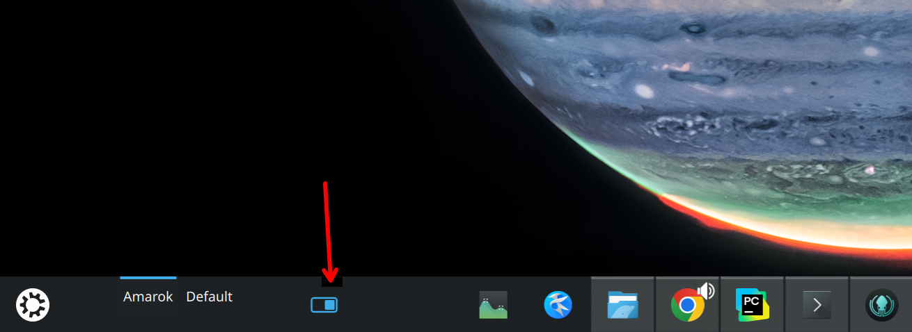
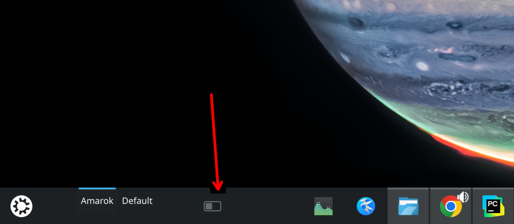

# plasma6-widgets

A collection of custom KDE Plasma 6 widgets.

## sergey-plasma6-widget

A small panel widget where you can add custom icons and bind arbitrary shell commands to each icon. Clicking the widget toggles between two configurable icons (A / B) and, optionally, runs the shell command associated with each state. An optional automatic time-based switch (day / night) is also available.

Use cases: quick toggle indicators on the panel — VPN on/off, mic mute/unmute, theme switcher, any custom on/off action backed by a shell command.

### Screenshots

**On state**



**Off state**



### Install

```sh
./pack.sh
kpackagetool6 -t Plasma/Applet -i sergey-plasma6-widget.tar.gz
```

To update an already installed copy:

```sh
kpackagetool6 -t Plasma/Applet -u sergey-plasma6-widget.tar.gz
```

After install, right-click the panel → *Add Widgets* → search for **Sergey Icon Switcher**.

### Configure

Right-click the widget → *Configure*:

- **Icon A / Icon B** — pick any icon from the current icon theme.
- **Execute the following command when switching to icon A / B** — enable and provide a shell command to run on each toggle.
- **Automatic Switching** — optionally switch states based on time of day.
